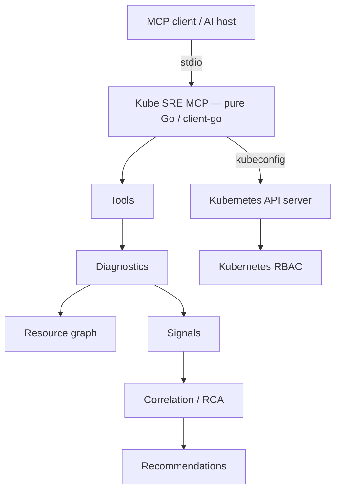

# Kube SRE MCP

[](https://github.com/ielyaakouby/kube-sre-mcp/actions/workflows/ci.yml)
[](https://github.com/ielyaakouby/kube-sre-mcp/actions/workflows/security.yml)
[](https://github.com/ielyaakouby/kube-sre-mcp/actions/workflows/codeql.yml)
[](go.mod)
[](LICENSE)
[](https://github.com/ielyaakouby/kube-sre-mcp/releases)

[Features](#features) · [How it works](#how-it-works) · [Safety](#safety) · [Tools](#mcp-tools) · [Getting Started](#getting-started) · [MCP Client Setup](#mcp-client-setup) · [Documentation](#documentation) · [Contributing](#contributing)

**Kubernetes SRE & Diagnostic MCP Server** written in Go.

**Pure Go** · **client-go** · **stdio** · **kubeconfig** · **Kubernetes RBAC**

Native [Model Context Protocol](https://modelcontextprotocol.io/) server for Kubernetes investigation: health analysis, events, logs, optional metrics, resource-graph correlation, ranked RCA, and a small set of gated corrective actions.

There is **no LLM inside this process** — the MCP host supplies reasoning. Kubernetes RBAC of the selected kubeconfig identity remains the authorization boundary.

Generic Kubernetes MCP servers typically expose list/get/mutate. **Kube SRE MCP is diagnostics-first.**

```text
Observe → Diagnose → Explain → Safely Act
```

Start with a [GitHub Release](#getting-started) binary. Go is not required to run it.

> **v1 runtime:** local process, **stdio only**, **kubeconfig only**. In-cluster ServiceAccount authentication, HTTP/SSE/Streamable HTTP MCP, and official container images are **not** supported. Details: [How it works](#how-it-works).

Kube SRE MCP is an independent open-source project. It is not a CNCF-hosted project and is not affiliated with the Apache Software Foundation.

## Why Kube SRE MCP

A generic Kubernetes MCP server typically does this:

```text
LLM  →  list / get resource  →  raw YAML, logs, or events
```

That gives an agent Kubernetes **data**. It does not systematically correlate owners, selectors, Events, logs, status, and dependencies, and it may mutate a cluster without SRE-style preflight.

Kube SRE MCP does this:

```text
LLM / MCP host
    →  Kube SRE MCP (pure Go, client-go)
        →  collect Kubernetes signals
        →  walk the resource graph
        →  Events, logs, status, dependencies
        →  optional metrics.k8s.io evidence
        →  correlate independent evidence
        →  ranked root-cause hypotheses
        →  recommendations
        →  controlled actions (off by default)
    →  Kubernetes API server  →  Kubernetes RBAC
```

The server is **deterministic**: the same cluster state produces the same structured diagnosis. The MCP client may narrate that JSON; it does not change ranking.

## See it in action

**User**

> Why is deployment payment-api unhealthy?

**Kube SRE MCP** (via `k8s_diagnose_deployment` / `k8s_diagnose_resource`)

1. Resolves the Deployment (kind aliases, optional prefix on **read** paths).
2. Follows the current ReplicaSet and child Pods.
3. Inspects workload and Pod status.
4. Collects Events and failing-container logs (redacted).
5. Checks graph dependencies (ConfigMaps, Secrets metadata, PVCs, imagePullSecrets, HPA/PDB links, …).
6. Includes CPU/memory when `metrics.k8s.io` is reachable.
7. Correlates evidence into ranked hypotheses and recommendations.

**Illustrative result** (conceptual; not a captured JSON fixture):

```text
health:              critical
root_cause.category: REGISTRY_AUTHENTICATION_FAILURE
confidence:          high

Evidence (examples of what the engine correlates):
  • Image pull failed on child Pods
  • Registry authentication rejected
  • Repeated FailedPull / ErrImagePull Events

recommended_actions:
  Verify imagePullSecret on the Pod/ServiceAccount
  (type kubernetes.io/dockerconfigjson).
  Restart is not the default fix for image/auth/config/mount failures.
```

Health values returned by the engine: `healthy`, `degraded`, `critical`, `unknown`. Incomplete RBAC visibility is `unknown`, not healthy.

More prompts: [docs/prompt-examples.md](docs/prompt-examples.md).

## Features

### SRE diagnostics

- Kind-specific analyzers: Pod, Deployment, StatefulSet, DaemonSet, Job, CronJob, Service, Ingress, PVC, Node
- Dedicated tools for Pod, Deployment, Service, and Node; other kinds go through `k8s_diagnose_resource`
- Generic resources / CRDs via discovery and `status.conditions` (`diagnostic_depth: generic`)
- Ranked root-cause hypotheses with confidence, impact, and evidence
- Cluster health inventory with capped deep diagnosis of unhealthy candidates

### Observability

- Kubernetes Events (`k8s_get_events`)
- Pod logs via the API, with failing-container auto-select and redaction (`k8s_get_logs`)
- Optional pod/node metrics when the metrics API is installed (not a separate MCP tool)
- Secret `.data` is never returned; logs, events, and errors are redacted

### Kubernetes-aware correlation

Bounded [resource graph](docs/resource-graph.md): owners, selectors, volumes, ConfigMaps/Secrets (metadata), ServiceAccounts, imagePullSecrets, EndpointSlices, Ingress backends, HPA, PDB, StorageClass/PV links.

### Safe operations

Read-only by default. When explicitly enabled: restart Deployment, scale Deployment/StatefulSet/ReplicaSet, delete Pod, cordon/uncordon Node.

### Native Go implementation

Implemented in **pure Go**. Talks to the Kubernetes API with `client-go` (typed, dynamic, and discovery clients).

- Does **not** shell out to `kubectl` and does **not** wrap `kubectl`
- Does **not** require `kubectl`, Node.js, or Python for its own Kubernetes operations
- Does **not** embed an LLM
- Distributed as a **native binary**; the MCP host provides the LLM side

## How it works



| v1 | Behavior |
| --- | --- |
| Execution | Local process |
| MCP transport | **stdio only** |
| Authentication | **kubeconfig only** (`KUBECONFIG` or `~/.kube/config`) |
| Authorization | Kubernetes RBAC of that kubeconfig identity |
| In-cluster / ServiceAccount auth | **Not supported** |
| Official container image | **Not published** (a `Dockerfile` exists for optional local builds only) |

Optional Prometheus process metrics can bind locally via `KUBE_SRE_MCP_METRICS_LISTEN`. That HTTP port is **not** an MCP transport.

Diagnostic path:

1. Resolve the resource (aliases, optional prefix, no silent guess on ambiguity).
2. Build a bounded resource graph.
3. Collect signals: status, Events, logs (failing container), dependencies, optional metrics.
4. Correlate independent evidence.
5. Rank likely root causes (confidence and impact).
6. Generate recommendations (restart is not the default for image/auth/config/mount failures).
7. Return health: `healthy` / `degraded` / `critical` / `unknown`.

Pending-pod scheduling analysis is an **approximate eligibility check**, not a kube-scheduler simulation.

Package layout, timeouts, and non-goals: [docs/architecture.md](docs/architecture.md). RCA details: [docs/diagnostic-engine.md](docs/diagnostic-engine.md).

## Safety

Kube SRE MCP is **read-only by default**. Mutating tools stay registered but return `status: disabled` unless `KUBE_SRE_MCP_ACTIONS_ENABLED=true`.

**Kubernetes RBAC remains the final authorization boundary.** The server cannot grant itself extra power.

Writes must still pass:

1. Kubernetes RBAC on the API server
2. SelfSubjectAccessReview (SSAR) allow for the verb
3. Explicit two-step confirmation (single-use token, TTL)
4. Confirmation bound to action, target, parameters, kubeconfig context, and object **UID**
5. Safety guards where implemented: PDB with `disruptionsAllowed=0` (restart / delete Pod), HPA list errors refuse the scale, last Ready schedulable Node (cordon), exact names (**no prefix match on writes**), plus refuse delete of mirror and control-plane Pods

Server-side confirmation is **not** proof that a human approved the operation. The MCP host must obtain human approval before resubmitting the confirmation token and must not auto-submit IDs.

Prefix match (`KUBE_SRE_MCP_PREFIX_MATCH`, default `true`) applies to **read** paths only. Ambiguous matches are listed, not guessed.

Details: [docs/security.md](docs/security.md), [docs/safe-actions.md](docs/safe-actions.md), [deploy/rbac.md](deploy/rbac.md), [SECURITY.md](SECURITY.md).

## MCP Tools

Full schemas, arguments, RBAC, and examples: **[CATALOG.md](CATALOG.md)**.

Tool identifiers are Kubernetes-oriented MCP names (`k8s_*`). They are **not** the product name.

### Diagnostics

| Tool | Mode | Purpose |
| --- | --- | --- |
| `k8s_diagnose_resource` | Diagnostic | Primary: diagnose any resource |
| `k8s_diagnose_pod` | Diagnostic | Deep Pod diagnosis |
| `k8s_diagnose_deployment` | Diagnostic | Deployment / ReplicaSet / Pod RCA |
| `k8s_diagnose_service` | Diagnostic | Service, EndpointSlices, backends |
| `k8s_diagnose_node` | Diagnostic | Node conditions, taints, events |

### Inspection

| Tool | Mode | Purpose |
| --- | --- | --- |
| `k8s_find_resource` | Read | Find by name across namespaces |
| `k8s_get_resource` | Read | Summarized get (Secrets stripped) |
| `k8s_list_resources` | Read | List a kind with selectors |

### Observability

| Tool | Mode | Purpose |
| --- | --- | --- |
| `k8s_get_logs` | Observability | Pod logs (redacted) |
| `k8s_get_events` | Observability | Kubernetes Events |

### Health and context

| Tool | Mode | Purpose |
| --- | --- | --- |
| `k8s_cluster_health` | Diagnostic | Inventory and aggregated health |
| `k8s_get_context` | Read | Current context / API server / namespace |
| `k8s_list_contexts` | Read | kubeconfig contexts |

### Actions

| Tool | Mode | Purpose |
| --- | --- | --- |
| `k8s_restart_deployment` | Write | Rollout-restart a Deployment |
| `k8s_scale_workload` | Write | Scale Deployment / StatefulSet / ReplicaSet |
| `k8s_delete_pod` | Write | Delete a Pod |
| `k8s_cordon_node` | Write | Cordon a Node |
| `k8s_uncordon_node` | Write | Uncordon a Node |

## Getting Started

### Requirements

To **run a release binary**:

- Reachable Kubernetes API
- A usable local kubeconfig
- An MCP client that can launch a local stdio process

Go is **not** required to download and run a prebuilt binary.

To **build from source**: [Go 1.26.6+](https://go.dev/dl/) (see `go.mod`).

### Install from GitHub Release

Official artifacts are native binaries on [Releases](https://github.com/ielyaakouby/kube-sre-mcp/releases):

| File | Platform |
| --- | --- |
| `kube-sre-mcp-linux-amd64` | Linux amd64 |
| `kube-sre-mcp-linux-arm64` | Linux arm64 |
| `kube-sre-mcp-darwin-amd64` | macOS amd64 |
| `kube-sre-mcp-darwin-arm64` | macOS arm64 |
| `kube-sre-mcp-windows-amd64.exe` | Windows amd64 |
| `checksums.txt` | SHA-256 sums |

```bash
chmod +x kube-sre-mcp-linux-amd64
mv kube-sre-mcp-linux-amd64 kube-sre-mcp
```

Windows: [docs/windows.md](docs/windows.md).

Windows 386 and extra Makefile `build-all-extra` targets are not official downloads.

### Run

```bash
export KUBECONFIG="$HOME/.kube/config"
./kube-sre-mcp
```

The process speaks MCP on **stdio** and writes JSON logs to **stderr**. It exits at startup if no usable kubeconfig is found.

If you built from source, the binary is `./bin/kube-sre-mcp`.

```bash
./kube-sre-mcp --version
./kube-sre-mcp --help
```

Optional: `KUBE_SRE_MCP_CONTEXT` selects a kubeconfig context; omit it to use `current-context`. Leave writes off until you intend to mutate (`KUBE_SRE_MCP_ACTIONS_ENABLED` defaults to `false`).

Next: [MCP Client Setup](#mcp-client-setup).

### Build from source

Required only for contributors and local development.

```bash
git clone https://github.com/ielyaakouby/kube-sre-mcp.git
cd kube-sre-mcp
make build
```

Output: `./bin/kube-sre-mcp`. Equivalent: `go build -o bin/kube-sre-mcp ./cmd/kube-sre-mcp`.

Optional helper (also a **source** build, not a release downloader): `bash install/install.sh` — [install/README.md](install/README.md).

A local Docker image (`make docker-build`) is still stdio MCP and still needs a **mounted kubeconfig**. It is not an official distribution channel.

## MCP Client Setup

**Transport: stdio only.** There is no HTTP, SSE, or Streamable HTTP MCP transport. Use an **absolute** path to the binary. Do not put cluster tokens in the config; point at a kubeconfig file.

Keep `KUBE_SRE_MCP_ACTIONS_ENABLED=false` until you explicitly want mutating tools.

`KUBE_SRE_MCP_CONTEXT` is optional. Omit it to use the kubeconfig `current-context`.

### Cursor

Project: `.cursor/mcp.json`. User: `~/.cursor/mcp.json`.

```json
{
  "mcpServers": {
    "kube-sre-mcp": {
      "command": "/absolute/path/to/kube-sre-mcp",
      "env": {
        "KUBECONFIG": "/absolute/path/to/.kube/config",
        "KUBE_SRE_MCP_LOG_LEVEL": "info",
        "KUBE_SRE_MCP_ACTIONS_ENABLED": "false"
      }
    }
  }
}
```

### Claude Desktop / Claude Code

The same stdio stanza works in Claude Desktop’s `mcpServers` config (for example `~/Library/Application Support/Claude/claude_desktop_config.json` on macOS) and in Claude Code hosts that launch a local command.

Windows paths and escaped backslashes: [docs/windows.md](docs/windows.md).

### Generic stdio MCP client

Any host that can spawn a local process and speak MCP on stdin/stdout can use the JSON above. Adapt the file location to your client.

## Usage Examples

Prefer **diagnose** when something is broken. Use find/get/list for inventory. Keep writes disabled until you confirm.

### Read / diagnose

```text
Is my Kubernetes cluster healthy?
Show unhealthy workloads in production.
Why is pod <name> failing?
Why is this pod in CrashLoopBackOff?
Why is deployment <name> degraded?
Show warning events for deployment <name>.
Show recent errors from pod <name>.
Find Deployment <name>; I don't know the namespace.
Diagnose <resource> and include CPU and memory if metrics are available.
```

### Write (actions enabled)

The first mutating call returns `confirmation_required`. Retry with `confirmation_id` only after the MCP host has obtained user approval.

```text
Restart deployment <name>.
Scale deployment <name> to 5 replicas.
Cordon node <name> for maintenance.
```

## Configuration

All settings are environment variables (`--help` / `--version` only as flags). Full table: [docs/configuration.md](docs/configuration.md).

| Variable | Default | Description |
| --- | --- | --- |
| `KUBECONFIG` | client-go default | kubeconfig path |
| `KUBE_SRE_MCP_CONTEXT` | current context | kubeconfig context |
| `KUBE_SRE_MCP_LOG_LEVEL` | `info` | `debug` / `info` / `warn` / `error` |
| `KUBE_SRE_MCP_ACTIONS_ENABLED` | `false` | Enable mutating tools (`K8S_MCP_ACTIONS_ENABLED` is ignored) |
| `KUBE_SRE_MCP_DIAGNOSTIC_TIMEOUT` | `45` | Per-tool timeout (seconds) |
| `KUBE_SRE_MCP_API_TIMEOUT_SECONDS` | `15` | Kubernetes client timeout |
| `KUBE_SRE_MCP_CONFIRMATION_TTL_SECONDS` | `120` | Action confirmation TTL |
| `KUBE_SRE_MCP_MAX_REPLICAS` | `100` | Scale upper bound |
| `KUBE_SRE_MCP_PREFIX_MATCH` | `true` | Prefix match on **read** paths only |
| `KUBE_SRE_MCP_METRICS_LISTEN` | empty | Optional Prometheus bind (unauthenticated) |

## Development

```bash
make help
make fmt
make vet
make test
make check
make license-check
```

Module path: `kube-sre-mcp`. Entry point: `cmd/kube-sre-mcp`. Version: `internal/version` (override with `-ldflags "-X kube-sre-mcp/internal/version.Version=0.1.0-beta.1"`).

The Go module path is the local name `kube-sre-mcp`, not `github.com/ielyaakouby/kube-sre-mcp`.

Tests under `internal/*` use fake client-go objects. A live cluster is not required for `make test`.

Operators debugging the running server: [docs/troubleshooting.md](docs/troubleshooting.md).

## Documentation

Index: **[docs/README.md](docs/README.md)**

| Doc | Topic |
| --- | --- |
| [docs/windows.md](docs/windows.md) | Native Windows 10/11 setup |
| [docs/usage.md](docs/usage.md) | Run the server and SRE workflows |
| [docs/architecture.md](docs/architecture.md) | Process and package layout |
| [docs/diagnostic-engine.md](docs/diagnostic-engine.md) | RCA pipeline and capability matrix |
| [docs/resource-graph.md](docs/resource-graph.md) | Ownership and dependency walks |
| [docs/security.md](docs/security.md) | Runtime security architecture |
| [docs/safe-actions.md](docs/safe-actions.md) | Mutating tools and confirmation |
| [docs/configuration.md](docs/configuration.md) | Environment variables |
| [docs/troubleshooting.md](docs/troubleshooting.md) | Operators debugging the server |
| [docs/prompt-examples.md](docs/prompt-examples.md) | Prompt library |
| [CATALOG.md](CATALOG.md) | MCP tool contract |
| [deploy/rbac.md](deploy/rbac.md) | Recommended Kubernetes permissions |
| [install/README.md](install/README.md) | Build from source |
| [CONTRIBUTING.md](CONTRIBUTING.md) | Development workflow |
| [CHANGELOG.md](CHANGELOG.md) | Release history |
| [CODE_OF_CONDUCT.md](CODE_OF_CONDUCT.md) | Community standards |
| [SECURITY.md](SECURITY.md) | Vulnerability reporting |

## Contributing

Kube SRE MCP is an open-source project built for the Kubernetes community, and contributions are welcome from everyone.

Whether you are an SRE, Platform Engineer, DevOps Engineer, Go developer, Kubernetes user, security engineer, documentation contributor, or making your first open-source contribution, you are welcome to participate.

You can help by:

- fixing bugs
- improving diagnostics and RCA
- adding tests
- improving documentation
- suggesting SRE workflows
- reporting issues

See [CONTRIBUTING.md](CONTRIBUTING.md) to get started. Open a pull request against `main` after `make check`.

For substantial behavioral or architectural changes, please [open an issue](https://github.com/ielyaakouby/kube-sre-mcp/issues) first so the approach can be discussed with the community.

Repository: [github.com/ielyaakouby/kube-sre-mcp](https://github.com/ielyaakouby/kube-sre-mcp).

## Security

Please report vulnerabilities privately. Do not open a public GitHub issue.

See **[SECURITY.md](SECURITY.md)** for supported versions, what to include, and GitHub Private Vulnerability Reporting.

Runtime model: [docs/security.md](docs/security.md). Mutating tools: [docs/safe-actions.md](docs/safe-actions.md).

## License

Kube SRE MCP is licensed under the [Apache License 2.0](LICENSE).

Copyright 2026 The Kube SRE MCP Authors.
