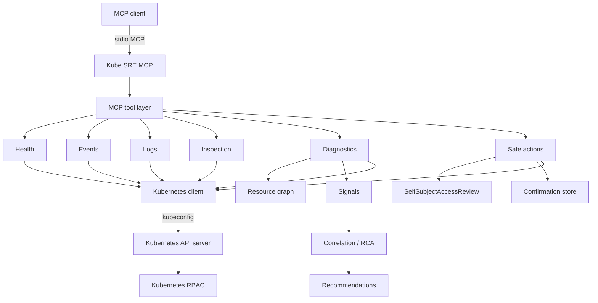

# Kube SRE MCP

[](https://github.com/ielyaakouby/kube-sre-mcp/actions/workflows/ci.yml)
[](https://github.com/ielyaakouby/kube-sre-mcp/actions/workflows/security.yml)
[](https://github.com/ielyaakouby/kube-sre-mcp/actions/workflows/codeql.yml)
[](LICENSE)
[](https://github.com/ielyaakouby/kube-sre-mcp/releases)

**Kubernetes SRE & Diagnostic MCP Server**

Kube SRE MCP is an open-source Model Context Protocol (MCP) server
written in Go for Kubernetes diagnostics, observability,
troubleshooting, root-cause analysis and safe operational actions.

Kube SRE MCP helps MCP-compatible AI clients understand, diagnose and safely
operate Kubernetes environments through structured Kubernetes-aware tools.

**Go · Kubernetes · MCP · Apache-2.0**

There is **no LLM inside this process**. The MCP host interprets the JSON.
Kubernetes RBAC remains the authorization boundary.

Kube SRE MCP is an independent open-source project built for the
Kubernetes and cloud-native ecosystem. It is not a CNCF-hosted project
and is not affiliated with the Apache Software Foundation.

## Who it is for

- Kubernetes administrators
- SREs
- Platform engineers
- DevOps engineers
- MCP clients that speak stdio MCP

## Why Kube SRE MCP

An LLM with raw `kubectl` can list objects and paste YAML. It does not
systematically correlate Events, logs, workload status, and dependencies, and
it can mutate a cluster without preflight checks.

Kube SRE MCP talks to the Kubernetes API with `client-go` (not by shelling out to
`kubectl`) and is built for SRE workflows:

- Kind-specific diagnostic analyzers (Pods, workloads, Services, Ingress, PVC, Nodes, plus generic CRDs)
- Resource graph (owners, selectors, volumes, EndpointSlices, HPA/PDB links)
- Event and log intelligence with central redaction
- Correlation into ranked root-cause hypotheses (confidence and impact)
- Cluster health inventory that treats RBAC gaps as `unknown`, not healthy
- Write path: feature-flagged, SelfSubjectAccessReview, confirmation tokens, PDB/HPA/last-node guards

## Key capabilities

- **Go-only** MCP server, single static binary, **stdio** transport
- **Kubernetes-aware** via typed, dynamic, and discovery clients
- **Structured diagnostics** instead of opaque command output
- **Event / log / metric correlation** when those APIs are reachable (`metrics.k8s.io` is optional)
- **Controlled actions**: restart Deployment, scale workload, delete Pod, cordon/uncordon Node
- **Secret safety**: Secret values are never returned; logs/events/errors are redacted
- **Least privilege**: Kubernetes RBAC of the kubeconfig identity is the authorization boundary

## Architecture

kube-sre-mcp currently runs locally and connects to Kubernetes using your existing kubeconfig. The Kubernetes identity and permissions are inherited directly from the selected kubeconfig context and enforced by Kubernetes RBAC.

```text
Current architecture — kubeconfig mode
======================================

Software version: 0.1.0-beta.1 (see internal/version; not an architecture label)

Execution:
  Local

MCP transport:
  stdio

Kubernetes authentication:
  kubeconfig

Authorization:
  Native Kubernetes RBAC associated with the kubeconfig identity

In-cluster authentication:
  Not supported in the current release
```

```text
┌───────────────────────────────┐
│ Claude / Cursor / MCP Client  │
└───────────────┬───────────────┘
                │
              stdio
                │
                ▼
┌───────────────────────────────┐
│         kube-sre-mcp          │
│                               │
│ Kubernetes client-go          │
└───────────────┬───────────────┘
                │
             kubeconfig
                │
                ▼
┌───────────────────────────────┐
│       kube-apiserver          │
│                               │
│ Kubernetes RBAC               │
└───────────────────────────────┘
```



Optional process metrics (Prometheus) can bind locally via `KUBE_SRE_MCP_METRICS_LISTEN`.
That HTTP port is **not** an MCP transport.

Details: [docs/architecture.md](docs/architecture.md). Documentation index: [docs/README.md](docs/README.md).

## Quick start

Requires [Go 1.25+](https://go.dev/dl/) and a local kubeconfig (`KUBECONFIG` or `~/.kube/config`).

```bash
git clone https://github.com/ielyaakouby/kube-sre-mcp.git
cd kube-sre-mcp

make build
./bin/kube-sre-mcp --help
./bin/kube-sre-mcp --version
```

The server speaks MCP on **stdio** and logs JSON to stderr:

```bash
./bin/kube-sre-mcp
```

Equivalent:

```bash
go run ./cmd/kube-sre-mcp
```

From source installer: `bash install/install.sh` ([install/README.md](install/README.md)). Native Windows: [docs/windows.md](docs/windows.md).

## Supported Platforms

Official community release artifacts:

| Platform | Architecture | Status |
| --- | --- | --- |
| Linux | amd64 | Supported |
| Linux | arm64 | Supported |
| macOS | amd64 | Supported |
| macOS | arm64 | Supported |
| Windows | amd64 | Supported |

Release files: `kube-sre-mcp-linux-amd64`, `kube-sre-mcp-linux-arm64`, `kube-sre-mcp-darwin-amd64`, `kube-sre-mcp-darwin-arm64`, `kube-sre-mcp-windows-amd64.exe`, plus `checksums.txt`. Windows 386 is not an official download.

## MCP client configuration

**Transport: stdio only.** There is no HTTP, SSE, or Streamable HTTP MCP transport.

Use an MCP host that can launch a local command and speak MCP on stdin/stdout.
Adapt this `mcpServers` stanza to your client’s config file.

`KUBE_SRE_MCP_CONTEXT` is **optional**. Omit it to use the kubeconfig `current-context`.

```json
{
  "mcpServers": {
    "kube-sre-mcp": {
      "command": "/absolute/path/to/kube-sre-mcp",
      "env": {
        "KUBECONFIG": "/home/you/.kube/config",
        "KUBE_SRE_MCP_LOG_LEVEL": "info",
        "KUBE_SRE_MCP_ACTIONS_ENABLED": "false"
      }
    }
  }
}
```

Use an absolute path to the binary. Do not put cluster tokens in the config file;
point at a kubeconfig file.

## MCP tools

Full schemas, RBAC, and examples: **[CATALOG.md](CATALOG.md)**.

| Tool | Category | Mode | Purpose |
| --- | --- | --- | --- |
| `k8s_diagnose_resource` | Diagnostics | Diagnostic | Primary: diagnose any resource |
| `k8s_diagnose_pod` | Diagnostics | Diagnostic | Deep Pod diagnosis |
| `k8s_diagnose_deployment` | Diagnostics | Diagnostic | Deployment / ReplicaSet / Pod RCA |
| `k8s_diagnose_service` | Diagnostics | Diagnostic | Service, EndpointSlices, backends |
| `k8s_diagnose_node` | Diagnostics | Diagnostic | Node conditions, taints, events |
| `k8s_find_resource` | Inspection | Read | Find by name across namespaces |
| `k8s_get_resource` | Inspection | Read | Summarized get (Secrets stripped) |
| `k8s_list_resources` | Inspection | Read | List a kind with selectors |
| `k8s_get_logs` | Observability | Observability | Pod logs (redacted) |
| `k8s_get_events` | Observability | Observability | Kubernetes Events |
| `k8s_cluster_health` | Health | Diagnostic | Inventory and aggregated health |
| `k8s_get_context` | Context | Read | Current context / API server / namespace |
| `k8s_list_contexts` | Context | Read | kubeconfig contexts |
| `k8s_restart_deployment` | Actions | Write / Action | Rollout-restart a Deployment |
| `k8s_scale_workload` | Actions | Write / Action | Scale Deployment / StatefulSet / ReplicaSet |
| `k8s_delete_pod` | Actions | Write / Action | Delete a Pod |
| `k8s_cordon_node` | Actions | Write / Action | Cordon a Node |
| `k8s_uncordon_node` | Actions | Write / Action | Uncordon a Node |

Tool identifiers are Kubernetes-oriented MCP names (`k8s_*`). They are **not** the product name.

## Usage examples

Prefer **diagnose** when something is broken. Use find/get/list for inventory.
Keep writes off until you explicitly confirm.

More prompts: [docs/prompt-examples.md](docs/prompt-examples.md) and [docs/usage.md](docs/usage.md).

### Cluster health

```text
Is my Kubernetes cluster healthy?
```

```text
Show me unhealthy workloads in production.
```

### Troubleshooting

```text
Why is pod <pod-name> failing?
```

```text
Why is this pod in CrashLoopBackOff?
```

### Events

```text
Show events for deployment <name> in namespace <namespace>.
```

### Logs

```text
Show recent errors from pod <name>.
```

### Metrics

Metrics are **not** a separate MCP tool. When the metrics API is installed,
diagnosis may include CPU/memory as supporting evidence (`metrics_available: false` otherwise).

```text
Diagnose <resource> and include CPU and memory usage if metrics exist.
```

### Resource inspection

```text
Describe deployment <name>.
```

```text
Find Deployment <name> — I don't know the namespace.
```

### Actions

Only with writes enabled. The first call returns `confirmation_required`;
repeat with `confirmation_id` only after the MCP host has obtained user approval.
kube-sre-mcp cannot guarantee that a human approved the second call.

```text
Restart deployment <name>.
```

```text
Scale deployment <name> to 5 replicas.
```

```text
Cordon node <name> for maintenance.
```

## Safety

### READ-ONLY TOOLS

Diagnostic, health, events, logs, and inspection tools only `get`/`list`
(and read pod logs). They never patch or delete. Prefix match may apply on
**read** paths when `KUBE_SRE_MCP_PREFIX_MATCH=true`.

### MUTATING / WRITE TOOLS

Five tools can modify the cluster:

| Tool | Kubernetes mutation | Extra guards |
| --- | --- | --- |
| `k8s_restart_deployment` | Patch Deployment pod template annotation | PDB, restart-not-recommended categories, UID bind |
| `k8s_scale_workload` | Patch `spec.replicas` | Max replicas, HPA fail-closed, UID bind |
| `k8s_delete_pod` | Delete Pod | Mirror/control-plane refuse, PDB, unmanaged warning |
| `k8s_cordon_node` | Patch Node `unschedulable=true` | Last Ready schedulable node refuse |
| `k8s_uncordon_node` | Patch Node `unschedulable=false` | Confirmation + UID bind |

They are **off** until `KUBE_SRE_MCP_ACTIONS_ENABLED=true`. If the flag is false, they return `status: disabled`.

Kubernetes RBAC is the authorization boundary. Kube SRE MCP cannot grant itself extra power.

Writes also require:

1. SelfSubjectAccessReview allow for the verb
2. A confirmation token bound to action, target, UID, context, and parameters (single-use, TTL)
3. Preflight guards (PDB, HPA, last Ready schedulable node, exact names — no prefix match on writes)

kube-sre-mcp uses a two-step confirmation protocol for mutating actions. The MCP host/client is responsible for presenting the confirmation request to the user and must not automatically submit confirmation IDs without user approval. Server-side confirmation is **not** proof of human interaction. Kubernetes RBAC remains the final authorization boundary.

```
MCP client
    →  Kube SRE MCP (stdio)
    →  kubeconfig identity
    →  Kubernetes API server
    →  Kubernetes RBAC (final allow/deny)
```

See [docs/security.md](docs/security.md), [docs/safe-actions.md](docs/safe-actions.md),
[deploy/rbac.md](deploy/rbac.md), and [SECURITY.md](SECURITY.md).

## How diagnostics work

1. Resolve kind + name (aliases, optional prefix match, no silent guess on ambiguity).
2. Get the object; walk a bounded resource graph.
3. Collect signals: status, Events, logs (failing container), dependencies, optional metrics.
4. Correlate independent evidence into ranked hypotheses.
5. Map the top category to recommendations (restart is **not** the default for image/auth/config/mount failures).
6. Report `healthy` / `degraded` / `critical` / `unknown`.

Pending-pod scheduling analysis is an **approximate eligibility check** against listed Nodes (Ready, cordon, selectors, required nodeAffinity `metadata.name`, taints, requests vs allocatable). It is not a kube-scheduler simulation. Required pod anti-affinity and topology spread are reported as unsupported constraints with reduced certainty.

## Installation

| Method | Command |
| --- | --- |
| Make | `make build` → `./bin/kube-sre-mcp` |
| Go | `go build -o bin/kube-sre-mcp ./cmd/kube-sre-mcp` |
| Script | `bash install/install.sh` |
| Container | `make docker-build` (image `kube-sre-mcp:0.1.0-beta.1` by default; mount a kubeconfig) |

## Running locally

Authentication is **kubeconfig only**. There is no ServiceAccount / in-cluster fallback.

Resolution order:

1. Explicit kubeconfig path already supported by the process (`KUBECONFIG`, including multiple paths with the OS list separator)
2. Otherwise the default local kubeconfig (`~/.kube/config`)

If no usable kubeconfig is found, the process exits before serving MCP.

Optional: `KUBE_SRE_MCP_CONTEXT` to select a kubeconfig context. When unset, kube-sre-mcp uses the kubeconfig `current-context`. Leave writes disabled until you intend to mutate:

```bash
export KUBECONFIG="$HOME/.kube/config"
export KUBE_SRE_MCP_LOG_LEVEL=info
export KUBE_SRE_MCP_ACTIONS_ENABLED=false
./bin/kube-sre-mcp
```

```bash
KUBECONFIG=/path/to/config kube-sre-mcp
```

```bash
KUBE_SRE_MCP_CONTEXT=production kube-sre-mcp
```

Compatible with normal Kubernetes workflows such as `kubectl config current-context` and `kubectl config get-contexts`.

## Docker

```bash
make docker-build
# docker build --build-arg VERSION=0.1.0-beta.1 -t kube-sre-mcp:0.1.0-beta.1 .
# docker build -t kube-sre-mcp:latest .
# docker build --build-arg VERSION=0.1.0-beta.1 -t your-registry/kube-sre-mcp:0.1.0-beta.1 .
```

The image is distroless, non-root, and still an **stdio MCP** process. A client must attach stdin/stdout (or `docker run -i`). There is no MCP HTTP port.

Running the image still requires a **mounted kubeconfig**. A Pod ServiceAccount token is not used for authentication.

```bash
docker run --rm -i \
  -v "$HOME/.kube/config:/kube/config:ro" \
  -e KUBECONFIG=/kube/config \
  kube-sre-mcp:0.1.0-beta.1
```

Do not assume that placing this binary in a Kubernetes Pod authenticates via its ServiceAccount.

In-cluster deployment using Kubernetes ServiceAccounts and remote MCP transport is planned for a future release.

## Configuration

All settings are environment variables (no CLI flags except `--help` / `--version`). Full table: [docs/configuration.md](docs/configuration.md).

| Variable | Default | Description |
| --- | --- | --- |
| `KUBECONFIG` | client-go default | kubeconfig path |
| `KUBE_SRE_MCP_CONTEXT` | current context | kubeconfig context |
| `KUBE_SRE_MCP_LOG_LEVEL` | `info` | `debug` / `info` / `warn` / `error` |
| `KUBE_SRE_MCP_ACTIONS_ENABLED` | `false` | Enable mutating tools |
| `KUBE_SRE_MCP_DIAGNOSTIC_TIMEOUT` | `45` | Per-tool timeout (seconds) |
| `KUBE_SRE_MCP_API_TIMEOUT_SECONDS` | `15` | Kubernetes client timeout |
| `KUBE_SRE_MCP_CONFIRMATION_TTL_SECONDS` | `120` | Action confirmation TTL |
| `KUBE_SRE_MCP_MAX_REPLICAS` | `100` | Scale upper bound |
| `KUBE_SRE_MCP_PREFIX_MATCH` | `true` | Prefix match on **read** paths only |
| `KUBE_SRE_MCP_METRICS_LISTEN` | empty | Optional Prometheus bind (unauthenticated) |

## Development

```bash
make help
make fmt
make vet
make test
make check
make license-check
```

Module path: `kube-sre-mcp`. Entry point: `cmd/kube-sre-mcp`. Version metadata: `internal/version` (override with `-ldflags "-X kube-sre-mcp/internal/version.Version=0.1.0-beta.1"`).

The Go module path is still the local name `kube-sre-mcp`, not `github.com/ielyaakouby/kube-sre-mcp`. Changing it would rewrite every import and is a separate decision.

## Testing

Tests live under `internal/*` and use fake client-go objects. A live cluster is not required.

```bash
make test
make test-race
make test-cover
```

## Troubleshooting

| Symptom | Likely cause | What to do |
| --- | --- | --- |
| Process exits at startup | No usable kubeconfig | Set `KUBECONFIG` or configure `~/.kube/config` |
| `status: disabled` on writes | `KUBE_SRE_MCP_ACTIONS_ENABLED=false` | Enable only with matching RBAC. `K8S_MCP_ACTIONS_ENABLED` is ignored. |
| `confirmation_required` | Expected first-step gate | Host should ask the user, then retry with `confirmation_id` |
| `forbidden` | SSAR or API RBAC deny | Grant the verb in [deploy/rbac.md](deploy/rbac.md) |
| Health `unknown` | Missing list/get permissions | Treat as incomplete visibility, not healthy |
| Empty metrics in diagnosis | No metrics-server | Expected; `metrics_available: false` |
| MCP client cannot start server | Relative `command` path | Use an absolute path to `bin/kube-sre-mcp` |

## Documentation

Index: **[docs/README.md](docs/README.md)**

- [docs/windows.md](docs/windows.md) — native Windows 10/11 setup
- [docs/usage.md](docs/usage.md) — run the server and SRE workflows
- [docs/architecture.md](docs/architecture.md) — process and package layout
- [docs/diagnostic-engine.md](docs/diagnostic-engine.md) — RCA pipeline and capability matrix
- [docs/resource-graph.md](docs/resource-graph.md) — ownership and dependency walks
- [docs/security.md](docs/security.md) — runtime security architecture
- [docs/safe-actions.md](docs/safe-actions.md) — mutating tools and confirmation
- [docs/configuration.md](docs/configuration.md) — environment variables
- [docs/troubleshooting.md](docs/troubleshooting.md) — operators debugging the server
- [docs/prompt-examples.md](docs/prompt-examples.md) — prompt library
- [CATALOG.md](CATALOG.md) — MCP tool contract
- [deploy/rbac.md](deploy/rbac.md) — recommended Kubernetes permissions for the kubeconfig identity
- [install/README.md](install/README.md) — build from source
- [CONTRIBUTING.md](CONTRIBUTING.md) — development workflow
- [CHANGELOG.md](CHANGELOG.md) — release history
- [CODE_OF_CONDUCT.md](CODE_OF_CONDUCT.md) — community standards
- [SECURITY.md](SECURITY.md) — vulnerability reporting

## Contributing

See [CONTRIBUTING.md](CONTRIBUTING.md). Open a pull request against `main` after `make check`.

Repository: [github.com/ielyaakouby/kube-sre-mcp](https://github.com/ielyaakouby/kube-sre-mcp). Issues: [github.com/ielyaakouby/kube-sre-mcp/issues](https://github.com/ielyaakouby/kube-sre-mcp/issues).

## License

Kube SRE MCP is licensed under the [Apache License 2.0](LICENSE).

Copyright 2026 The Kube SRE MCP Authors.

The complete license text is available in the [`LICENSE`](LICENSE) file
and from the official Apache source:

https://www.apache.org/licenses/LICENSE-2.0.txt
